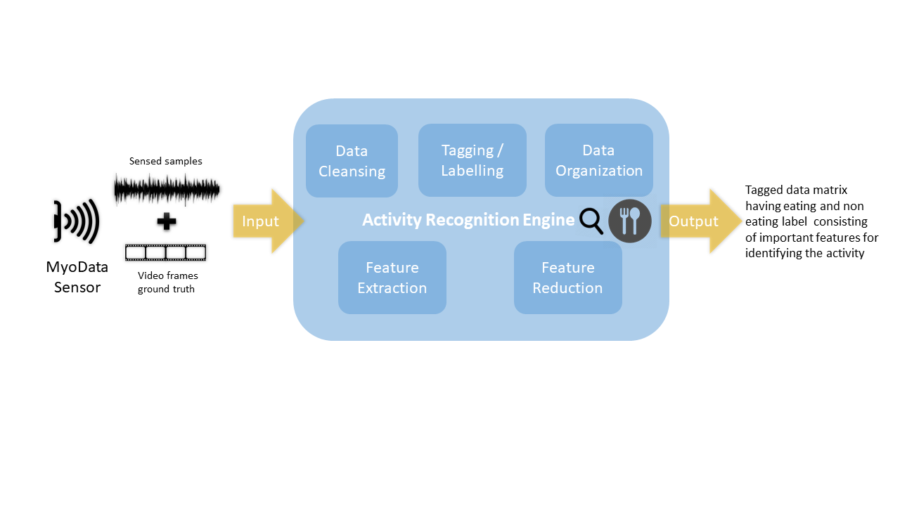

# Activity Recognition

Data plays an important role for everyone, be it an individual or organization. One might be interested in analyzing the historical trends and predicting the trend for future eg. An e-commerce player would want to study the sales of previous years and build a campaign for the current year. It would be essential to find out the attributes - intrinsic or extrinsic affecting the sale, which would help decide the scale of the campaign, effort to be put for the campaign and different ways of campaigning in order to hit the required target. Doing this manually would seem like an age-old solution to the problem when there were no computers, but today we can use the machine in order to predict such a trend. Similarly, given a data stream i.e. continuously varying data points with respect to time, it is difficult to identify an activity purely based on the sensed data. Hence arises the need for Data Mining which involves data cleansing - noise removal, handling missing data values, feature extraction - analyzing the given data to mine useful features in order to study different activities, feature reduction - to retain the minimum number of features required to clearly categorize the activities and activity recognition - building a model based on these features to help recognize an activity. This summarizes briefly the goal of the project and can be further extended to any such problem in the realm of Data Mining.

